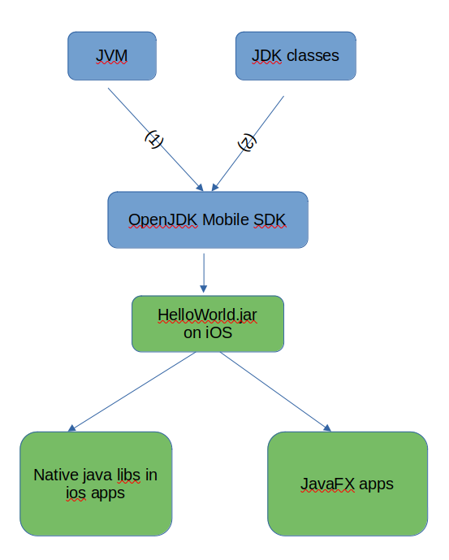

# iOS Support

Bringing Java to iOS follows a staged approach. First we validate the runtime with a minimal example, then we provide two independent tracks for developers: generating Java libraries for use in iOS projects, or building full JavaFX applications.

This is shown in the following image.

## Tracks

- [HelloWorld on iOS](ios/helloworld.md) – Validate the VM and class libraries with a minimal program.
- [Java Libraries for iOS](ios/library.md) – Expose Java methods to be callable from Objective-C/Swift.
- [JavaFX Applications on iOS](ios/javafx.md) – Build full JavaFX apps for iOS.
